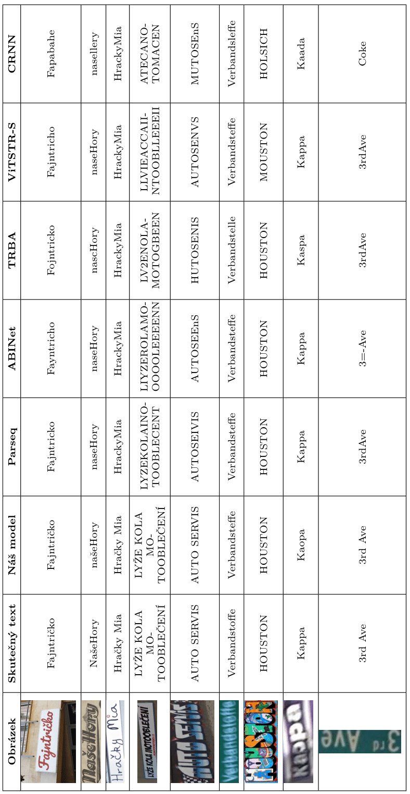

# Přepis ozdobných nápisů
### Baseline
  - knn.ipynb - Načtení a otestování přesnosti [ParSEQ](https://github.com/baudm/parseq) modelu.
### Natrénované modely
  - Na tomto [odkazu](https://drive.google.com/drive/folders/1jsmSuNVoA33oGUKzIUBaNZN2STZSDUtC) naleznete dotrénovaný model na datovou sadu Wordart a natrénovaný model na český jazyk a mezery.
  - Výsledky modelu v porovnání s jinými můžete vidět v tabulce níže.

### Použité datové sady
 - datové sady použité taktéž při trénování PARSeq, jsou dostupné [zde](https://github.com/baudm/parseq/blob/main/Datasets.md).
 - ostatní datové [sady](https://drive.google.com/drive/folders/1Aqv98d6O5m63FeeysN_s6VxpA8nlGTKJ), jedná se o Wordart, naši syntetickou datovou sadu pro trénování na češtinu a mezery a sadu s historických dokumentů.
### Analýza datové sady
  - dataStat.py - Analýza délky slov a výskytu znaků podle labels.
  - imageRes.py - Analýza velikosti obrázků dle obrázků.
### Výsledky
  - Soubor report.pdf obsahuje zprávu o provedené práci v rámci tohoto projektu.
  - Soubory plakát.pdf a plakát.png obsahují plakát vhodný pro rychlé seznámení s naší prací.
### Generování syntetické datové sady
#### Textové soubory využitelné pro generování syntetických obrázků:
  - random_words.txt - Vytvořené generátorem náhodných slov.
  - word_pairs.txt - Vytvořené z random_words.txt s využitím generátoru dvojic (pairs_gen.py)
  - czech_words.txt - Smysluplnější slova až trojice slov vytvořené s využitím chatGPT.
#### Scripty pro generování syntetických obrázků
  - pairs_gen.py - Generátor dvojic slov ze seznamu slov.
  - image_gen.py - Generátor obrázků z textového dokumentu slov. Využívá [trdg](https://github.com/Belval/TextRecognitionDataGenerator/tree/master).
### Tvorba datové sady
- filtr_labels.py - Pomocný program pro odstranění neanotovaných řádků z labelů a změna cest.
- filtr_images.py - Pomocný program pro vytvoření složky obrázků, obsahujících pouze anotované vzorky.

