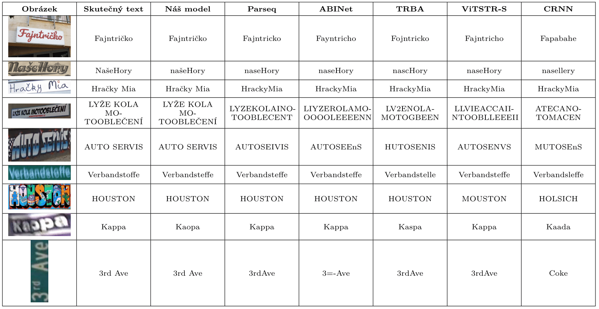

# Přepis ozdobných nápisů
### Baseline
  - knn.ipynb - Načtení a otestování přesnosti [ParSEQ](https://github.com/baudm/parseq) modelu.
### Natrénované modely
  - Na tomto [odkazu](https://drive.google.com/drive/folders/1jsmSuNVoA33oGUKzIUBaNZN2STZSDUtC) naleznete dotrénovaný model na datovou sadu Wordart a natrénovaný model na český jazyk a mezery.
  - Výsledky modelu v porovnání s jinými můžete vidět v tabulce níže.

### Použité datové sady
 - datové sady použité taktéž při trénování PARSeq, jsou dostupné [zde](https://github.com/baudm/parseq/blob/main/Datasets.md).
 - ostatní datové [sady](https://drive.google.com/drive/folders/1Aqv98d6O5m63FeeysN_s6VxpA8nlGTKJ), jedná se o Wordart, naši syntetickou datovou sadu pro trénování na češtinu a mezery a sadu historických dokumentů.
### Analýza datové sady
  - utils/dataStat.py - Analýza délky slov a výskytu znaků podle labels.
  - utils/imageRes.py - Analýza velikosti obrázků dle obrázků.
### Výsledky
  - Soubor docs/report.pdf obsahuje zprávu o provedené práci v rámci tohoto projektu.
  - Soubory docs/plakát.pdf a docs/plakát.png obsahují plakát vhodný pro rychlé seznámení s naší prací.
### Generování syntetické datové sady
#### Textové soubory využitelné pro generování syntetických obrázků:
  - czech.txt - Kolekce cca 500 000 českých slov.
#### Scripty pro generování syntetických obrázků
  - utils/pairs_gen.py - Generátor dvojic slov ze seznamu slov.
  - utils/image_gen.py - Generátor obrázků z textového dokumentu slov. Využívá [trdg](https://github.com/Belval/TextRecognitionDataGenerator/tree/master).
### Tvorba datové sady
- utils/filtr_labels.py - Pomocný program pro odstranění neanotovaných řádků z labelů a změna cest.
- utils/filtr_images.py - Pomocný program pro vytvoření složky obrázků, obsahujících pouze anotované vzorky.

### Použité nástroje
| Submodul                     |   Cesta              |  Licence      | Licenční soubor                            |
|------------------------------|-----------------|-------------------|-----------------------|
| [PARSeq](https://github.com/baudm/parseq)                       | external/parseq                       | Apache 2.0   | [LICENSE](external/parseq/LICENSE)        |
| [TextRecognitionDataGenerator](https://github.com/Belval/TextRecognitionDataGenerator) | external/TextRecognitionDataGenerator | MIT       | [LICENSE](external/TextRecognitionDataGenerator/LICENSE) |

